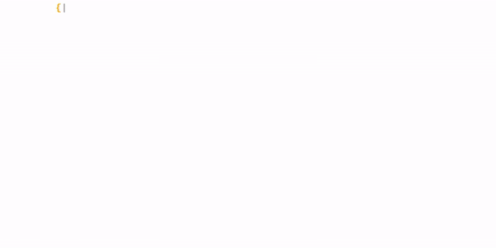

## Others Contacts and works:

  
  
  
  
   
  
  
  

<table width="40%">
  <tr>
    <th colspan="7">
        ### Languages and tools 👨🏻‍💻:
    </th>

  <tr  style="display: flex;">
    <td valign="top"></td>
  </tr>
  <tr  style="display: flex;">
    <td valign="top"></td>
    <td valign="top"></td>
  </tr>
  <tr  style="display: flex;">
    <td valign="top"></td>
    <td valign="top"></td>
    <td valign="top"></td>
  </tr>
  <tr  style="display: flex;">
    <td valign="top"></td>
    <td valign="top"></td>
    <td valign="top"></td>
    <td valign="top"></td>
  </tr> 
  <tr  style="display: flex;">
    <td valign="top"></td>
    <td valign="top"></td>
    <td valign="top"></td>
    <td valign="top"></td>
    <td valign="top"></td>
  </tr> 
  <tr  style="display: flex;">
    <td valign="top"></td>
    <td valign="top"></td>
    <td valign="top"></td>
    <td valign="top"></td>
    <td valign="top"></td>
    <td valign="top"></td>
  </tr>
  </tr>
</table>

## Experience:

  
  

    

## I'm studying at the moment 📖📚

  
  
  
   
  
  
 

 
 
